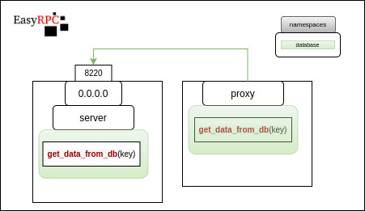
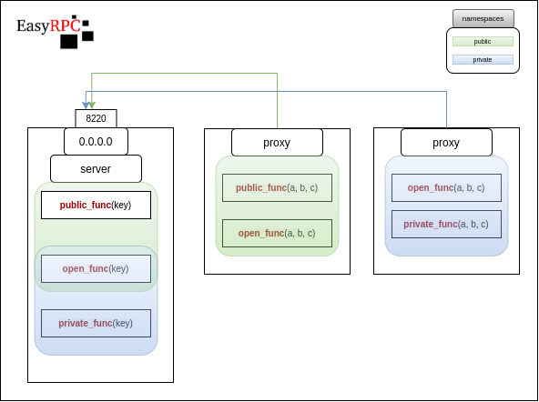

## Usage

### Basic



#### EasyRpcServer
```python
# server.py
from fastapi import FastAPI
from easyrpc.server import EasyRpcServer

server = FastAPI()

rpc_server = EasyRpcServer(
    server, 
    '/ws/server_a',
    server_secret='abcd1234'
)

@rpc_server.origin(namespace='database')
async def get_data_from_db(key):
    return await db.select('*', where={'name': key})
```
```bash
# start server
uvicorn --host 0.0.0.0 --port 8090 server:server
```
#### EasyRpcProxy
```python
# client.py
import asyncio
from easyrpc.proxy import EasyRpcProxy

async def main():
    proxy = await EasyRpcProxy.create(
        '0.0.0.0', 
        8090, 
        '/ws/server_a', 
        server_secret='abcd1234',
        namespace='database'
    )

    get_data_from_db = proxy['get_data_from_db']
    result = await get_data_from_db('foo')
    print(result)

asyncio.run(main())
```
### Multiple Namespaces


#### EasyRpcServer
    # server.py
```python
from fastapi import FastAPI
from easyrpc.server import EasyRpcServer

server = FastAPI()

easy_server = EasyRpcServer(server, '/ws/easy', server_secret='abcd1234')

@easy_server.origin(namespace='private')
def private_function(a, b, c):
    print(f"private_function {a} {b} {c}")
    return {"private_function": [a, b, c]}

@easy_server.origin(namespace='public')
def public_func(a, b, c):
    print(f"public_func {a} {b} {c}")
    return {"public_func": [a, b, c]}

@easy_server.origin(namespace='public')
@easy_server.origin(namespace='private')
def open_function(a, **kw):
    print(f"open_function {a} {kw}")
    return {"open_function": [a, kw]}

```
```bash
# start server
uvicorn --host 0.0.0.0 --port 8090 server:server
```

#### EasyRpcProxy
```python
# client.py
import asyncio
from easyrpc.proxy import EasyRpcProxy

async def main():
    easy_proxy = await EasyRpcProxy.create(
        '0.0.0.0', 
        8220, 
        '/ws/easy', 
        server_secret='abcd1234',
        namespace='private'
    )

    result = await easy_proxy['private_function'](1, 5, 7)
    print(result)
    
    result = await easy_proxy.proxy_funcs['open_function'](
        1, 
        keyword='value'
    )
    print(result)

    print(easy_proxy.proxy_funcs)

asyncio.run(main())
```

#### Output

```bash
# Start server
$ uvicorn --host 0.0.0.0 --port 8220 bsc_server:server
11-06 22:10 EasyRpc-server /ws/easy WARNING  ORIGIN - registered function private_function in private namespace
11-06 22:10 EasyRpc-server /ws/easy WARNING  ORIGIN - registered function public_func in public namespace
11-06 22:10 EasyRpc-server /ws/easy WARNING  ORIGIN - registered function open_function in private namespace
11-06 22:10 EasyRpc-server /ws/easy WARNING  ORIGIN - registered function open_function in public namespace
```

```bash
# Client
$ python client.py
{'private_function': [1, 5, 7]}
{'open_function': [1, {'keyword': 'value'}]}
{'private_function': <function create_proxy_from_config.<locals>.__proxy__ at 0x7fa0be5b4dd0>, 'open_function': <function create_proxy_from_config.<locals>.__proxy__ at 0x7fa0bdf3f050>}
```